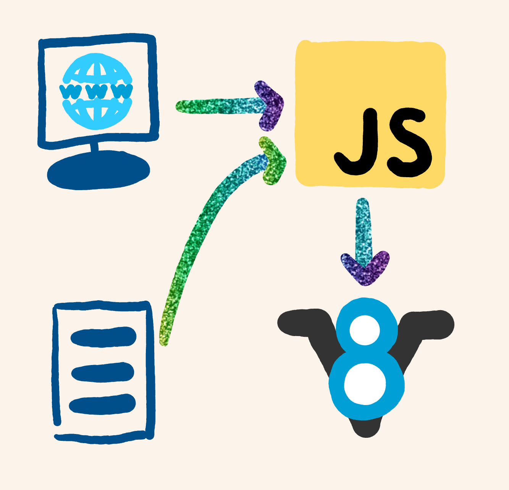
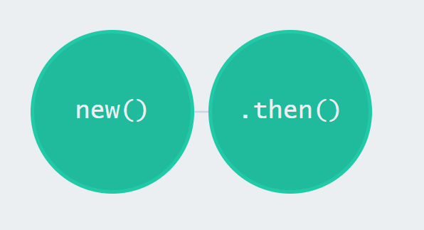

# Node.js

An Introduction to Node.js


By me, Kyle Mitofsky, a developer

---

## Execute Code

* **Language**
* **Execution Environment**


### Client and Server



---


## ECMAScript [20??](https://codeburst.io/javascript-wtf-is-es6-es8-es-2017-ecmascript-dca859e4821c)


### Function Declaration

```js
// function declaration
function SayHi (name) {
    console.log(`Hi: ${name}`)
}

// function expression / assignment
let SayHey = function (name) {
    console.log(`Hey: ${name}`)
}

// arrow function / lambda
SayHello (name) => {
    console.log(`Hello: ${name}`)
}
```

Note: func delcarations -> are hoisted to the top of the scope (immediately available).  
arrow func -> lecical this (defined by outer scope)


### Functions Invocation

```js
SayHi('kyle');

SayHi.Call(this, 'kyle');    // C for Comma

SayHi.Apply(this, ['kyle']); // A for Array
```


### Function Return

#### Return Value

```js
function Multiply(a, b) {
    return a * b
}
// invoke
let result = Multiply(2,5)
console.log(result)
```

#### Callbacks

```js
function Multiply(a, b, callback) {
    callback(a * b) // pretend this took a while
}

// invoke w/ anonymous function
Multiply(2,5, (result) => {
    console.log(result)
})
```


### Promises

```js
// wrap a callback in a promise
function MultiplyPromise(a,b) {
    return new Promise((resolve) => {
        Multiply(a, b, (result) => {
            // resolve promise from inside callback
            resolve(result)
        });
    });
}
```


### Promise with Callback

```js
let multPromise = MultiplyPromise(a,b)

multPromise.then(result => {
  console.log(result)
})
```

<a href="https://bevacqua.github.io/promisees/#code=var+p1+%3D+Promise.race(%5B%0A++new+Promise(resolve+%3D%3E+setTimeout(resolve%2C+4000))%2C%0A++new+Promise((resolve%2C+reject)+%3D%3E+setTimeout(reject%2C+8000))%0A%5D)%0A%0Avar+p2+%3D+Promise.race(%5B%0A++p1%2C%0A++new+Promise(resolve+%3D%3E+setTimeout(resolve%2C+6000))%2C%0A++new+Promise(resolve+%3D%3E+setTimeout(resolve%2C+10000))%2C%0A++new+Promise((resolve%2C+reject)+%3D%3E+setTimeout(reject%2C+2000))%0A%5D)%0A%0Ap2.then(result+%3D%3E+console.log(result))%0Ap2.catch(err+%3D%3E+console.error(err)))">
    
</a>


### Promise with `Async` / `Await`

```js
(async function(){

    let result = await MultiplyPromise(a,b)
    console.log(result)

})()
```

---

# Demo Time

---

## Resources

* [NodeJs Calendar Quickstart](https://developers.google.com/calendar/quickstart/nodejs)